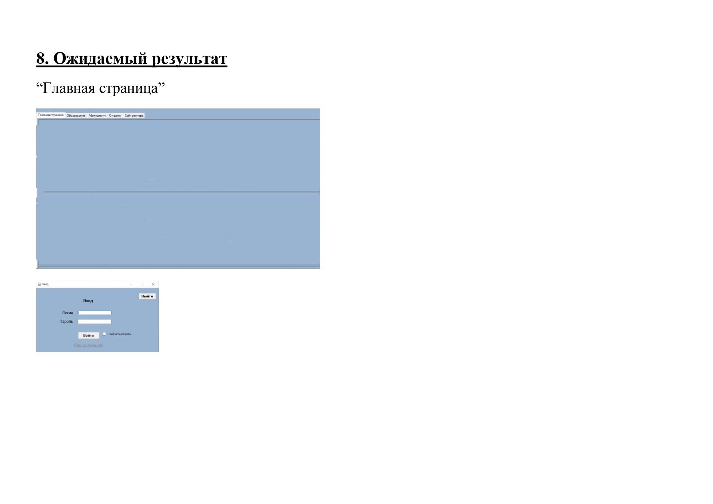
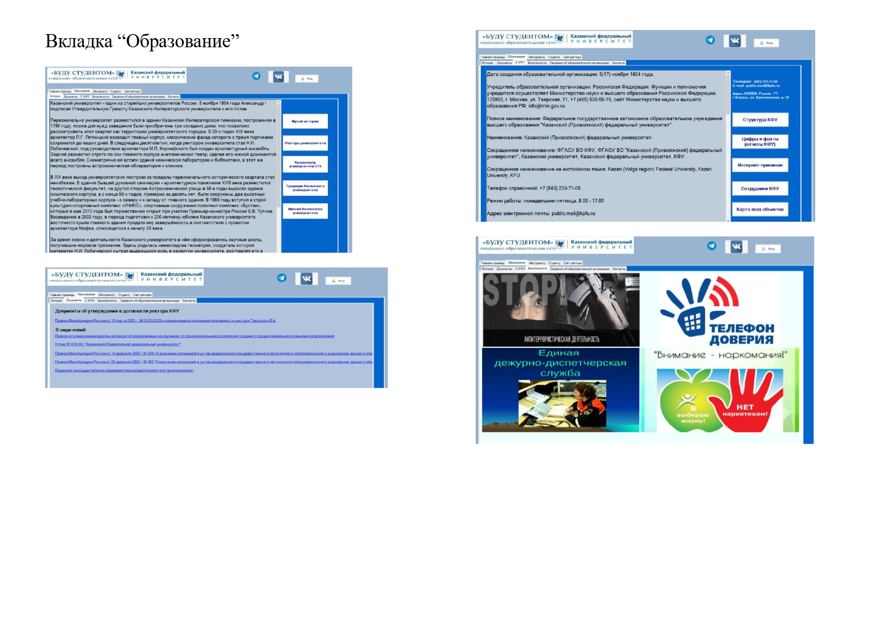
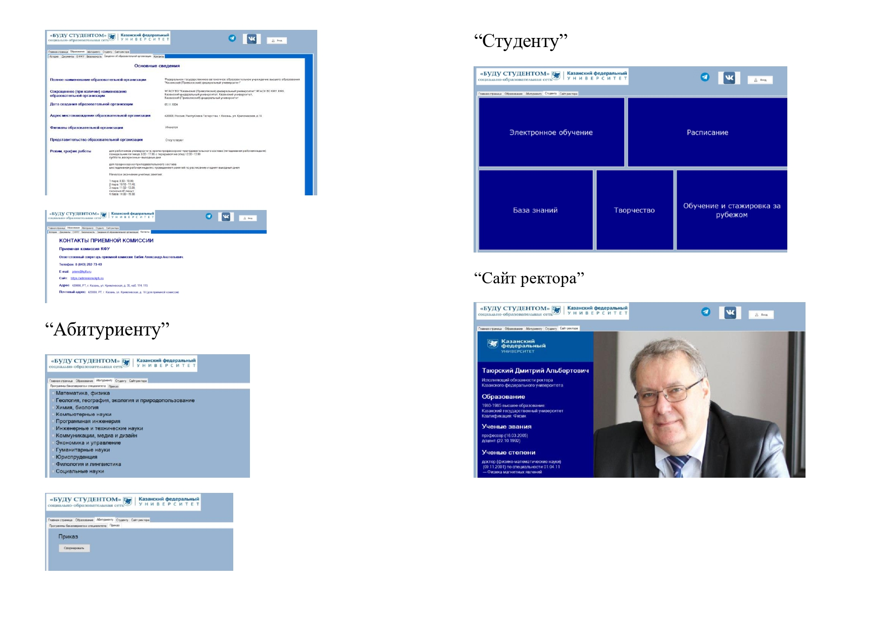
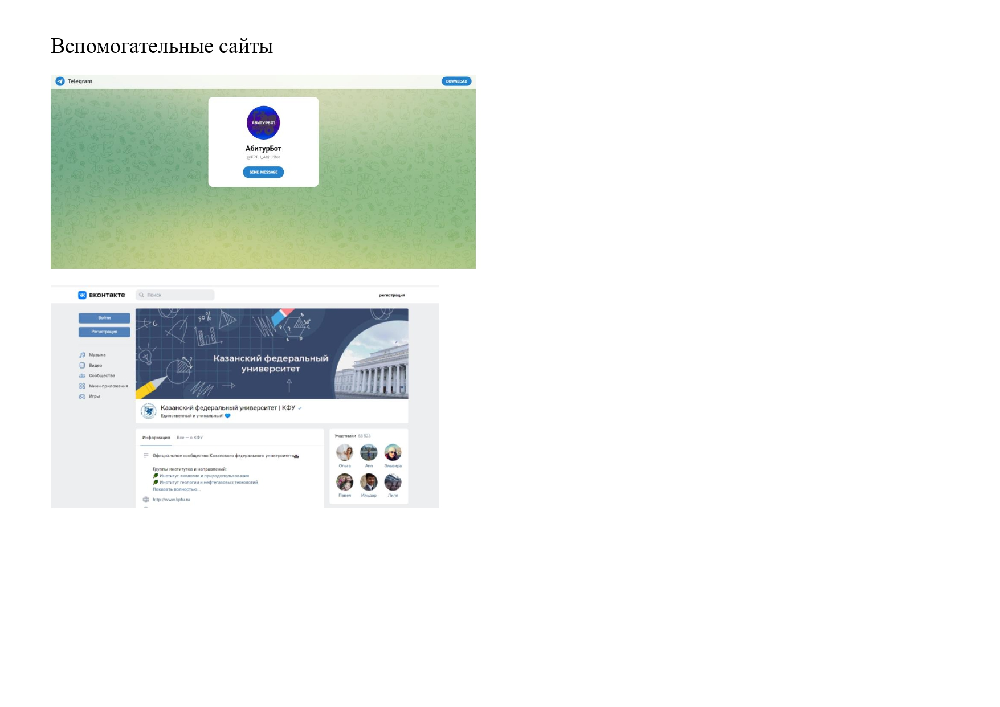

## Поступашка

##### Технологии: C#, Windows Forms, SQL, Entity Framework, Unit test

Программа предназначена для автоматизации обработки результатов поступления в университет,
информации об абитуриентах и институте. Она оперирует следующими данными:
- данные об абитуриентах;
- данные о пользователях сайта;

Программа должна обеспечивает возможность выполнения перечисленных ниже функций:
- возможность вывода информации об университете;
- добавление/удаление пользователей сайта;
- изменение данных об абитуриентах;
- возможность вывода информации о поступивших в институт(приказ о зачислении);

